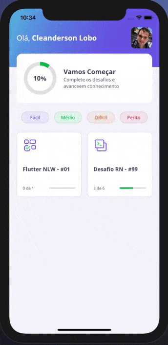

# Dev.Quiz_

Projeto desenvolvido na trilha de Flutter na NLW #05 provido pela Rocketseat.

São cinco dias desenvolvendo uma aplicação de um Quiz.

## Figma

# Day 3 - Preview 

Uma pequena prévia do que foi desenvolvido nas aulas até o 3º dia do evento.

# Day 5 - Preview 

Resultado do 5º dia da NLW.

*Obs: No Decorrer da NLW fui adicionando ou alterando algumas features.*

## Author

*	[Cleanderson Lobo](https://www.linkedin.com/in/cleandersonlobo/)