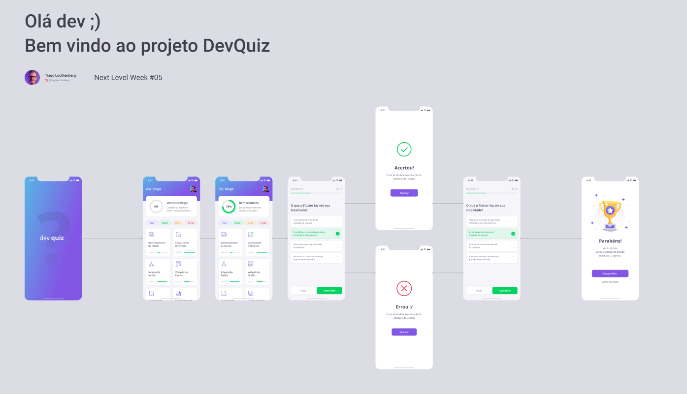
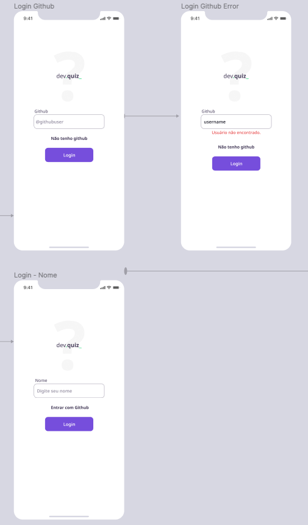
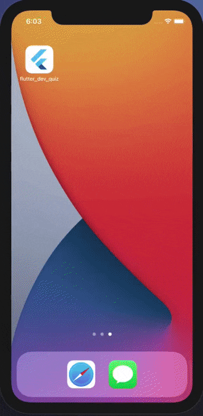
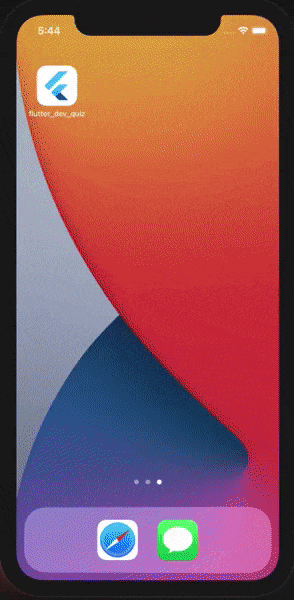

  

  

    Projeto desenvolvido na trilha de Flutter na NLW #05 provido pela Rocketseat.
     
     
    Foram cinco dias desenvolvendo de evento com objetivo de desenvolver essa aplicação.
  

## Projeto Figma

# Fluxo Login - Adicional
Foi adicionado ao projeto, um fluxo de login após SplashScreen, com a possivilidade de carregar usuário pela API do Github ou usando o nome.

- Login pelo usuário do Github (API);
- Login pelo nome (sem foto);

# Day 5 - Preview 

Resultado após o 5º dia da NLW5.

# Final version

Adicionando um plus com "Login" usando usuário do Github que contem nome e foto ou opção de digitar o somente o nome.

## Author

*	[Cleanderson Lobo](https://www.linkedin.com/in/cleandersonlobo/)

## Show Support
* [Recommend Me On LinkedIn](https://www.linkedin.com/in/cleandersonlobo/) - I will realy Appriciate this
* Don't forget to star ⭐ the repo 😉, it's FREE.